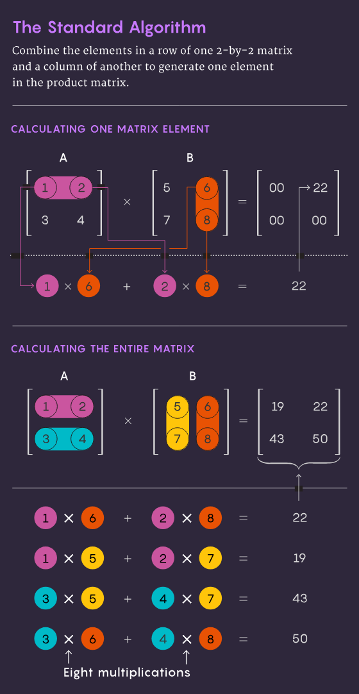
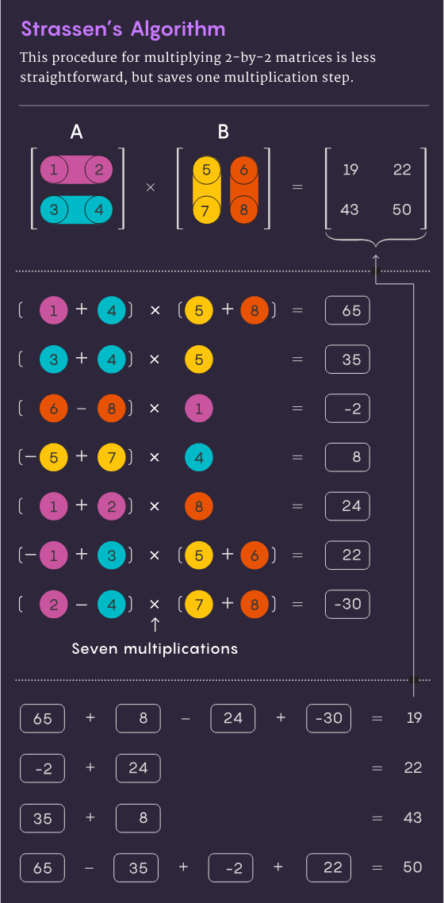
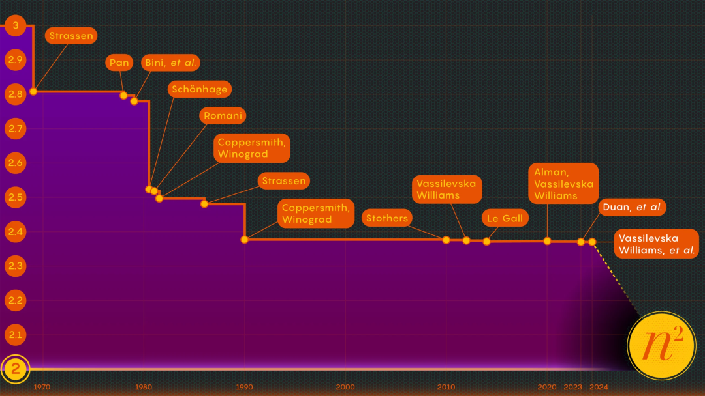

# Reinforcement Learning for Optimized Matrix Multiplication

## Overview
This project applies reinforcement learning (RL) to discover efficient algorithms for matrix multiplication. By simulating a learning environment for matrix operations, RL agents are trained to minimize the number of operations required. The ultimate goal is to find strategies that outperform conventional algorithms on computational resources, focusing on leveraging the power of an NVIDIA RTX 4090 GPU with PyTorch.

Matrix multiplication may seem like an obscure problem, but it is a fundamental computational operation. It is incorporated into most of the algorithms people use every day for a variety of tasks, from displaying clearer computer graphics to solving logistics problems in network theory. As in other areas of computing, speed is of the essence. Even small improvements can end up significantly reducing the time, computing power, and money required. But for now, theorists are mainly interested in figuring out just how fast this process can be.

The traditional method of multiplying two n by n matrices - multiplying the numbers in each row of the first matrix with the numbers in each column of the second matrix - requires n³ independent multiplication operations. For a 2-by-2 matrix, this means that you need to perform 2³, or 8 multiplications.



In 1969, mathematician Volker Strassen discovered an even more ingenious way to multiply a 2×2 matrix in just seven multiplication steps and 18 addition steps. Two years later, computer scientist Shmuel Winograd proved that 7-step multiplication is indeed an absolute minimum for a 2×2 matrix.



Matrix multiplication, as the fundamental operation of many GPU operators, is one of the important problems in high performance computing and the cornerstone of applications such as AI. Its algorithmic mechanism itself is quite simple, but in order to achieve faster speed, people have been working hard for many years, the degree of optimization has been limited.



## Getting Started

### Prerequisites
- Python 3.8 or higher
- Pip package manager
- An NVIDIA GPU with CUDA support is recommended for training the models.

### Installation
1. Clone the repository:
   ```bash
   git clone https://github.com/ForestR/matrix-rl-optimization.git
   ```
2. Navigate to the cloned directory:
   ```bash
   cd matrix-rl-optimization
   ```
3. Create a virtual environment:
   ```bash
   python -m venv venv
   ```
4. Activate the virtual environment:
   - On Windows:
     ```bash
     .\venv\Scripts\activate
     ```
   - On Unix or MacOS:
     ```bash
     source venv/bin/activate
     ```
5. Install the required dependencies:
   ```bash
   pip install -r requirements.txt
   ```

## Usage
To start training an RL agent to optimize matrix multiplication, run:
```bash
python train.py
```
Adjust configurations in `config.py` to customize the training process.

## Project Structure
- `agents/`: RL agents implementing algorithms like DQN and PPO.
- `envs/`: Custom environments for matrix multiplication.
- `models/`: Neural network architectures.
- `utils/`: Utility functions for logging and other tasks.
- `tests/`: Unit tests to ensure code integrity.
- `checkpoints/`: Model checkpoints saved during training.
- `runs/`: Training run logs and outputs.
- `main.py`: Main script to run experiments.
- `train.py`: Training script for the RL agents.
- `config.py`: Configuration settings for the project.

## Contributing
We welcome contributions! Please read `CONTRIBUTING.md` for details on our code of conduct and the process for submitting pull requests to us.

## License
This project is licensed under the Apache License - see the `LICENSE.md` file for details.

## Acknowledgments
- Thanks to all the contributors who spend time to improve matrix multiplication efficiency.
- Special thanks to the maintainers of the PyTorch library.

## Contact
- Insert contact information or remove this section if not applicable.
